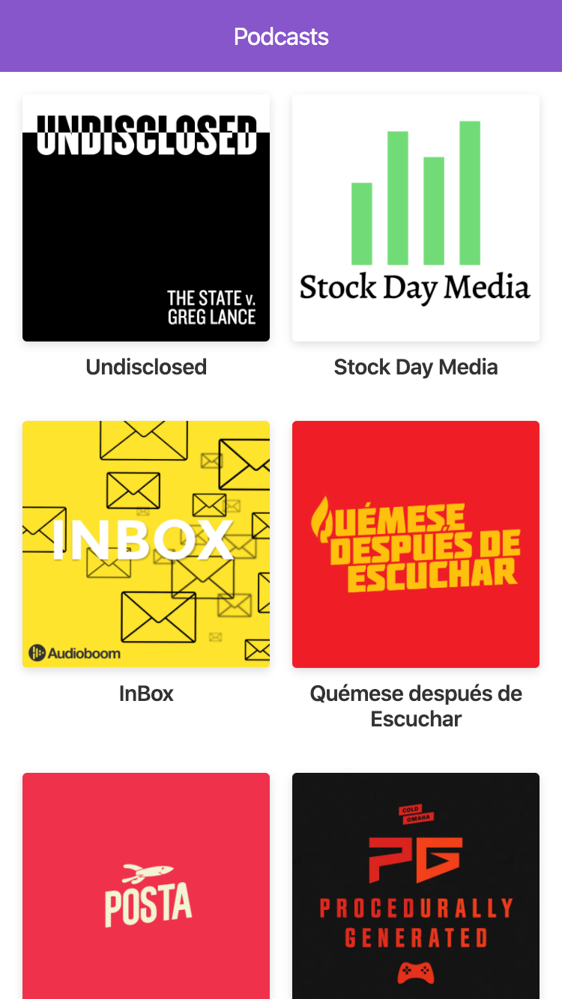

# App de Podcasts

App de podcast integrada con la API de AudioBoom para aprender Next.js

## ¿Cómo funciona?

Requiere Node 10.15 o superior

* `npm install` para correr las dependencias
* `npm run dev` para el entorno de desarrollo
* `npm run build && npm start` para el entorno de producción

## Licencia

MIT - John Alexander Agudelo